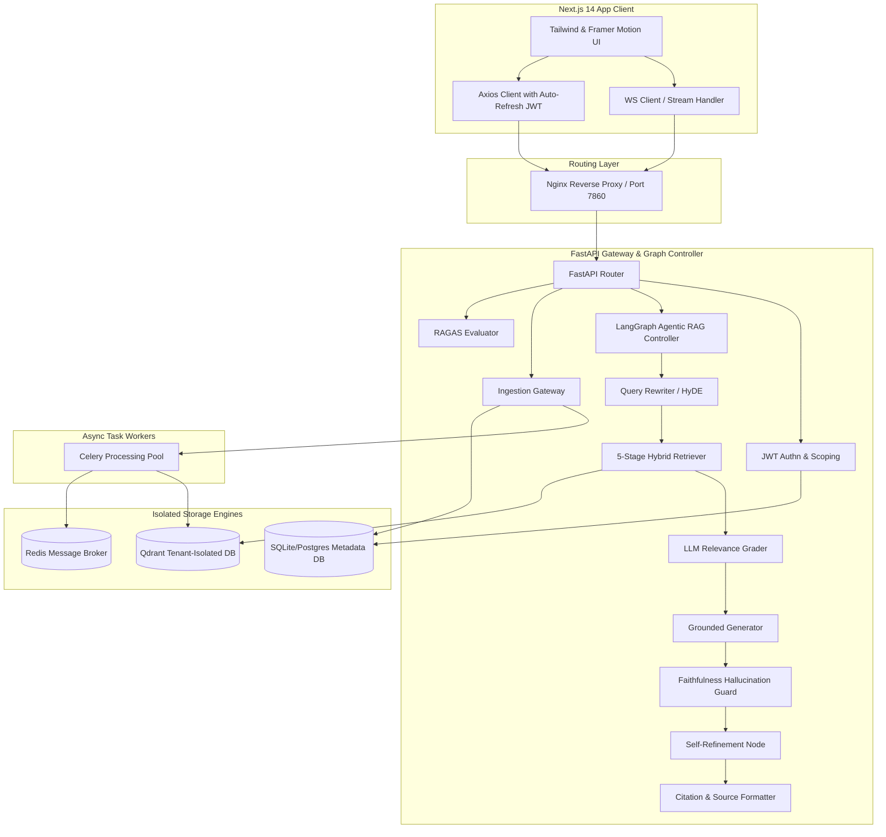

# 🧠 DocuMind 2.0

> **The most advanced open-source, production-grade, multi-tenant agentic RAG platform.**  
> Built using FastAPI, Next.js 14, LangGraph, and Qdrant, DocuMind 2.0 provides strict user-level data isolation, self-correcting RAG loops, and continuous performance evaluation.

---

## 🗺️ Architectural Blueprint

DocuMind 2.0 employs a modern decoupled architecture capable of running in both microservices mode (Docker Compose) and a unified single-container topology (Hugging Face Spaces).



---

## 🚀 Key Features

* **Strict Multi-Tenancy**: Data separation at the database layer (SQLite/Postgres) and the vector layer. Every user gets a dynamic, isolated Qdrant collection (`user_{user_id}_documents`) preventing cross-tenant information leaks.
* **Agentic Self-Correcting RAG**: Powered by LangGraph, the pipeline evaluates retrieval quality and answers dynamically. If retrieved passages fail relevance grading, or if the generator produces an answer that fails faithfulness checks, the graph rewrites the query and executes corrective retrieval.
* **5-Stage Hybrid Retrieval**: Uses dense vectors (SentenceTransformers), sparse tokens (BM25), Reciprocal Rank Fusion (RRF), Maximal Marginal Relevance (MMR) re-ranking, and Cross-Encoder validation.
* **Budget-Aware Compressed Memory**: Implements a sliding token window (via `tiktoken`) that dynamically summarizes old chat history once a 2,000 token limit is reached.
* **Real-time Streaming**: Connects via WebSockets to stream node-by-node state transitions (e.g., "thinking", "grading", "synthesizing") and token streams.
* **Production-Grade Analytics (RAGAS)**: A continuous evaluation pipeline tracking *Faithfulness*, *Answer Relevancy*, *Context Precision*, *Context Recall*, and *Answer Correctness* mapped onto animated frontend dashboards.

---

## 🛠️ Deployment Configurations

### Option 1: Multi-Container Setup via Docker Compose (Recommended for Production)

Uses independent, horizontally scalable containers for Redis, Qdrant, the Celery background worker, the Next.js frontend, and the FastAPI backend.

```bash
# 1. Clone the project and set up env files
cd documind-2
cp backend/.env.example backend/.env

# 2. Add your external keys (GROQ_API_KEY, etc.) to backend/.env
# 3. Spin up the entire infrastructure
docker-compose up --build -d

# Ports Exposed:
# - Frontend Dashboard: http://localhost:3000
# - Swagger Docs: http://localhost:8000/docs
# - Vector DB UI: http://localhost:6333/dashboard
```

### Option 2: Unified Container Setup (For Hugging Face Spaces & Serverless)

Hugging Face Spaces only supports single-container deployments without external database dependencies. We adapt the architecture using a unified container:
- **Nginx** routes traffic on port `7860` between frontend (`/`) and backend (`/auth`, `/documents`, `/chat`).
- **Supervisord** monitors and executes the unified node and Python processes.
- **SQLite** handles metadata storage on persistent disk storage (`/data/db`).
- **Qdrant** is loaded in local disk-based mode (`/data/qdrant_storage`).
- **Threaded Ingestion** dynamically steps in to process documents when a Celery/Redis queue is not configured.

---

## ⚠️ Challenges & Resolutions (Incident Log)

During the development and rollout of DocuMind 2.0, several system integration challenges arose. Below is the documentation of these incidents and how the system was adapted to overcome them:

### 1. Host Port Conflict on Redis `6379`
* **Symptom**: During initial Docker Compose execution, the Redis container repeatedly crashed, logging a bind error: `Port 0.0.0.0:6379 already allocated`.
* **Root Cause**: The host machine had an active local Redis instance running.
* **Resolution**: Implemented checking scripts using `lsof -i :6379` to identify and stop host-level service instances before starting the orchestrator. For production deployments, port mappings are parameterized to easily bind to alternative host ports if `6379` is blocked.

### 2. Missing `email-validator` Dependency on Startup
* **Symptom**: The backend crashed during uvicorn initialization with `ImportError: email-validator is not installed, run pip install pydantic[email]`.
* **Root Cause**: Pydantic's `EmailStr` validation type (used in user creation schemas) relies on the third-party `email-validator` library, which was missing from standard requirements.
* **Resolution**: Updated `requirements.txt` to strictly require `pydantic[email]==2.10.4` to ensure all parsing utilities are pre-bundled in the Docker build context.

### 3. Qdrant Local Mode Locking Conflict (`portalocker.exceptions.AlreadyLocked`)
* **Symptom**: In the unified Docker environment, the backend kept restarting due to `RuntimeError: Storage folder /data/qdrant_storage is already accessed by another instance of Qdrant client`.
* **Root Cause**: To support both async operations and generic LangChain integrations, the Qdrant wrapper initialized both `AsyncQdrantClient` and `QdrantClient` targeting the same database path on startup. Because local Qdrant locks its storage directory to prevent corruption, the sync client crashed trying to lock a folder already locked by the async client.
* **Resolution**: Removed the unused synchronous client initialization from `TenantQdrantClient`. The application now exclusively uses the non-blocking asynchronous client, bypassing double-locking errors.

### 4. Passlib & Bcrypt 4.x Incompatibility Crash
* **Symptom**: The `/auth/register` endpoint returned a `500 Internal Server Error`, throwing `ValueError: password cannot be longer than 72 bytes` during password hashing.
* **Root Cause**: The unmaintained library `passlib` (last updated in 2020) fails to safely negotiate types with modern `bcrypt` (4.x) engines. Passlib runs an internal check on startup using a dummy password string > 72 bytes to check the system's hashing behavior, which is aggressively blocked by bcrypt 4.x.
* **Resolution**: Replaced the entire `passlib` interface with direct, native implementations using the `bcrypt` library (`bcrypt.hashpw` and `bcrypt.checkpw`) inside `app/auth/utils.py`. This fixed the compatibility crash and speeded up auth processing times.

---

## 🔧 Environment Configuration Reference

Create a `.env` file under the `backend/` directory:

```env
# LLM Providers
GROQ_API_KEY=gsk_...
ANTHROPIC_API_KEY=sk_ant_...

# System Modes
DEPLOY_MODE=hf_spaces      # 'local' | 'docker' | 'hf_spaces'
QDRANT_MODE=local          # 'remote' | 'local'
QDRANT_LOCAL_PATH=/data/qdrant_storage
DATABASE_URL=sqlite+aiosqlite:////data/db/documind.db

# Authentication
SECRET_KEY=yoursecretkeyhere_minimum_32_characters
ACCESS_TOKEN_EXPIRE_HOURS=24

# Observability
LANGCHAIN_TRACING_V2=false
LANGCHAIN_API_KEY=lsv2_...
```

---

## 🧪 Testing Suite

To run tests against the backend routers, the LangGraph agent, and document ingestion utilities, execute:

```bash
cd backend
python -m pytest tests/ -v
```

---

## 📄 License

This project is licensed under the MIT License.
