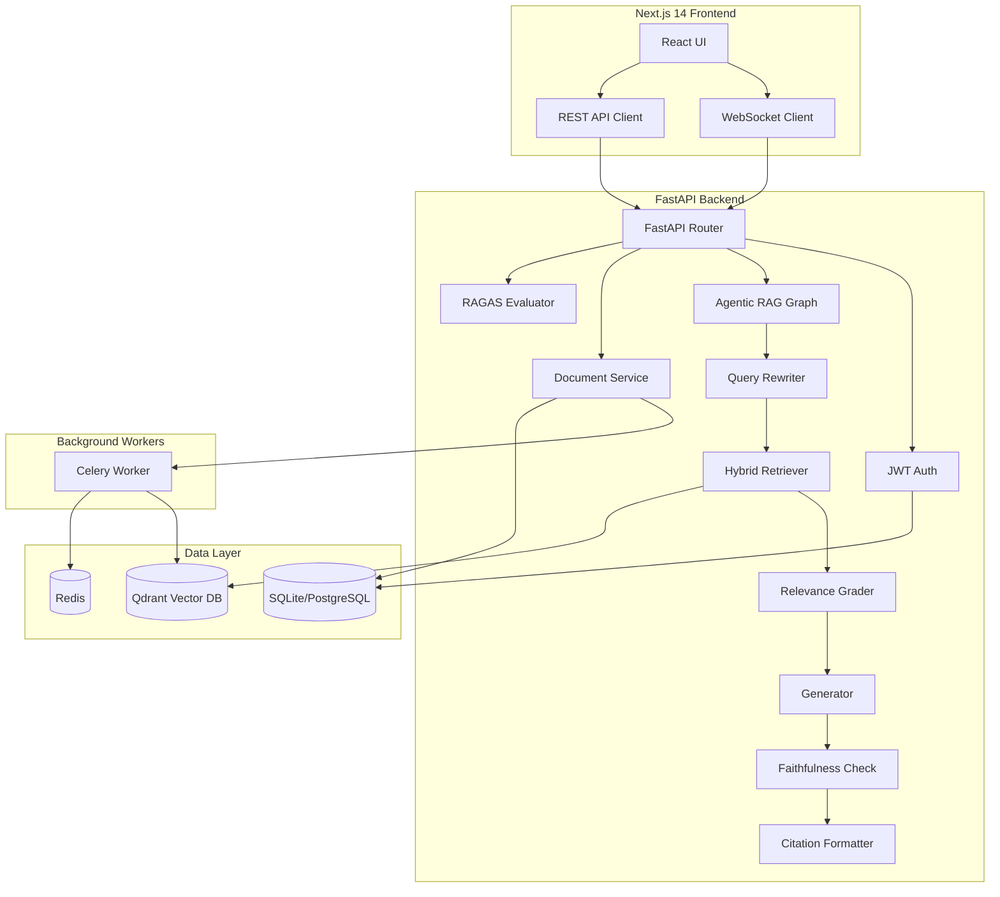

# DocuMind 2.0

**The most advanced open-source RAG system — Production-grade, multi-user, agentic document intelligence.**

## Architecture



## Quick Start

### With Docker (recommended)

```bash
# 1. Clone and configure
cp backend/.env.example backend/.env
# Edit backend/.env with your API keys

# 2. Start everything
docker-compose up --build

# 3. Open the app
# Frontend: http://localhost:3000
# Backend API: http://localhost:8000/docs
# Qdrant Dashboard: http://localhost:6333/dashboard
```

### Manual Setup

```bash
# Backend
cd backend
python -m venv venv && source venv/bin/activate
pip install -r requirements.txt
cp .env.example .env  # Edit with your keys
uvicorn app.main:app --reload --port 8000

# Start Redis & Qdrant (Docker)
docker run -d -p 6379:6379 redis:7-alpine
docker run -d -p 6333:6333 qdrant/qdrant:latest

# Celery Worker
celery -A app.documents.ingestion.tasks worker --loglevel=info

# Frontend
cd frontend
npm install
npm run dev
```

## Environment Variables

| Variable | Description | Required |
|----------|-------------|----------|
| `GROQ_API_KEY` | Groq API key for LLM | ✅ |
| `ANTHROPIC_API_KEY` | Anthropic API key (Claude fallback) | ❌ |
| `QDRANT_URL` | Qdrant server URL | ✅ |
| `DATABASE_URL` | SQLAlchemy database URL | ✅ |
| `REDIS_URL` | Redis connection URL | ✅ |
| `SECRET_KEY` | JWT signing key (min 32 chars) | ✅ |
| `LANGCHAIN_API_KEY` | LangSmith API key | ❌ |
| `UPLOAD_DIR` | File upload directory | ✅ |

## Agentic RAG Graph

The RAG pipeline uses LangGraph with 7 self-correcting nodes:

1. **Query Rewriter** — Decomposes multi-part questions, generates HyDE documents, step-back prompting
2. **Hybrid Retriever** — Dense (cosine) + BM25 (keyword) + Reciprocal Rank Fusion + MMR + CrossEncoder
3. **Relevance Grader** — LLM grades each chunk, filters irrelevant ones
4. **Generator** — Produces answer grounded in retrieved context
5. **Faithfulness Checker** — Extracts claims and verifies against sources (threshold: 0.8)
6. **Answer Refiner** — Rewrites hallucinated answers to be grounded
7. **Citation Formatter** — Structures source references with page numbers

## RAGAS Evaluation

Five metrics tracked continuously:

| Metric | Description | Threshold |
|--------|-------------|-----------|
| **Faithfulness** | Is the answer grounded in context? | ≥ 0.8 🟢 |
| **Answer Relevancy** | Does the answer address the question? | ≥ 0.8 🟢 |
| **Context Precision** | Are retrieved chunks relevant? | ≥ 0.6 🟡 |
| **Context Recall** | Was all needed info retrieved? | ≥ 0.6 🟡 |
| **Answer Correctness** | Is the answer factually correct? | ≥ 0.8 🟢 |

## DocuMind 1.0 vs 2.0

| Feature | v1.0 | v2.0 |
|---------|------|------|
| Frontend | Streamlit | Next.js 14 |
| Backend | Single app.py | FastAPI (async) |
| Auth | None | JWT + multi-tenant |
| Vector DB | FAISS (shared) | Qdrant (per-user) |
| Chunking | Fixed 800 chars | Semantic + structural |
| Retrieval | Dense only | Hybrid 5-stage |
| RAG Pipeline | Linear chain | LangGraph agentic |
| Memory | Raw history | Token-budget compressed |
| Ingestion | Synchronous | Async (Celery) |
| Evaluation | None | RAGAS (5 metrics) |
| Streaming | Streamlit | WebSocket |
| Observability | None | LangSmith + Loguru |

## Tech Stack

**Backend:** Python 3.12, FastAPI, LangChain, LangGraph, Qdrant, Celery, Redis, SQLAlchemy  
**Frontend:** Next.js 14, TypeScript, Tailwind CSS, Zustand, Framer Motion  
**Infra:** Docker, Docker Compose, Qdrant, Redis

## Testing

```bash
cd backend
pytest tests/ -v
```

## License

MIT
